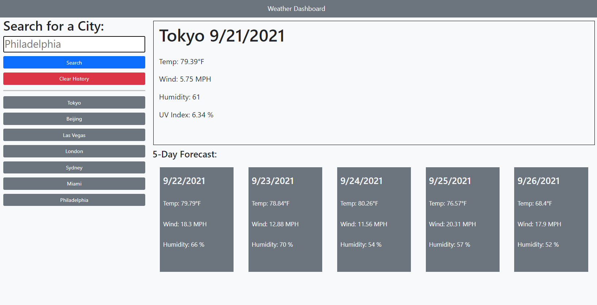

# weather-dashboard

## Description
This website is an interactive weather dashboard. You can search for cities in the search bar. Past searches will appear as buttons below the search bar which you can click to get the weather for those cities again. When searching for a city or using the past searches, you can view the current weather and a 5 day forecast for that city. This website was built using HTML, CSS, JavaScript as well as Bootstrap and jQuery.
## Table of Contents
- [Installation](#installation)
- [Usage](#usage)
- [How To Contribute](#how-to-contribute)
- [Tests](#tests)
## Installation
N/A
## Usage
You can visit the website here: https://markcirineo.github.io/weather-dashboard/

## How to Contribute
You can contact me here: markcirineo22@gmail.com
## Tests
N/A